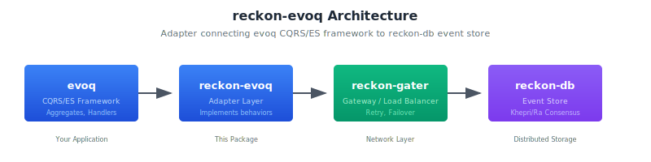

# reckon-evoq

[](https://hex.pm/packages/reckon_evoq)
[](https://hexdocs.pm/reckon_evoq)
[](https://buymeacoffee.com/beamologist)

Adapter for connecting [evoq](https://github.com/reckon-db-org/evoq) CQRS/ES framework to [reckon-db](https://github.com/reckon-db-org/reckon-db) event store via [reckon-gater](https://github.com/reckon-db-org/reckon-gater) gateway.

## Overview

reckon-evoq is a thin adapter layer that implements the evoq behavior interfaces:

- `evoq_adapter` - Event store operations (append, read, delete)
- `evoq_snapshot_adapter` - Snapshot operations (save, read, delete)
- `evoq_subscription_adapter` - Subscription operations (subscribe, ack, checkpoint)

All operations are routed through reckon-gater, which provides:

- **Automatic retry** with exponential backoff
- **Load balancing** across gateway workers
- **High availability** with failover support

## Installation

Add to your `rebar.config`:

```erlang
{deps, [
    {reckon_evoq, "~> 1.0"}
]}.
```

## Dependencies

This adapter requires:

- **evoq** >= 1.0.0 - CQRS/ES framework with behavior definitions
- **reckon-gater** >= 1.0.0 - Gateway API for load balancing and retry
- **reckon-db** >= 1.0.0 - The underlying event store (must be running)

## Quick Start

### 1. Configure evoq to use this adapter

In your `sys.config`:

```erlang
{evoq, [
    {adapter, reckon_evoq_adapter},
    {snapshot_adapter, reckon_evoq_adapter},
    {subscription_adapter, reckon_evoq_adapter}
]}
```

### 2. Ensure reckon-db is running

The adapter requires an reckon-db cluster to be available. Gateway workers automatically discover and connect to reckon-db nodes.

### 3. Use evoq normally

```erlang
%% Create a command
Command = evoq_command:new(deposit, bank_account, <<"acc-123">>, #{amount => 100}),

%% Dispatch through evoq (uses this adapter internally)
ok = evoq_dispatcher:dispatch(Command).
```

## API Reference

### Event Store Operations

```erlang
%% Append events to a stream
reckon_evoq_adapter:append(StoreId, StreamId, ExpectedVersion, Events).
%% Returns: {ok, NewVersion} | {error, Reason}

%% Read events from a stream
reckon_evoq_adapter:read(StoreId, StreamId, StartVersion, Count, Direction).
%% Direction: forward | backward
%% Returns: {ok, [Event]} | {error, Reason}

%% Read all events from a stream (batched internally)
reckon_evoq_adapter:read_all(StoreId, StreamId, Direction).
%% Returns: {ok, [Event]} | {error, Reason}

%% Read events by type (server-side Khepri filtering)
reckon_evoq_adapter:read_by_event_types(StoreId, EventTypes, BatchSize).
%% Returns: {ok, [Event]} | {error, Reason}

%% Get stream version
reckon_evoq_adapter:version(StoreId, StreamId).
%% Returns: Version (integer) | -1 (no stream)

%% Check if stream exists
reckon_evoq_adapter:exists(StoreId, StreamId).
%% Returns: boolean()

%% List all streams
reckon_evoq_adapter:list_streams(StoreId).
%% Returns: {ok, [StreamId]} | {error, Reason}

%% Delete a stream
reckon_evoq_adapter:delete_stream(StoreId, StreamId).
%% Returns: ok | {error, Reason}
```

### Snapshot Operations

```erlang
%% Save a snapshot
reckon_evoq_adapter:save(StoreId, StreamId, Version, Data, Metadata).
%% Returns: ok | {error, Reason}

%% Read latest snapshot
reckon_evoq_adapter:read(StoreId, StreamId).
%% Returns: {ok, #snapshot{}} | {error, not_found}

%% Read snapshot at specific version
reckon_evoq_adapter:read_at_version(StoreId, StreamId, Version).
%% Returns: {ok, #snapshot{}} | {error, not_found}

%% Delete all snapshots for stream
reckon_evoq_adapter:delete(StoreId, StreamId).
%% Returns: ok

%% Delete snapshot at specific version
reckon_evoq_adapter:delete_at_version(StoreId, StreamId, Version).
%% Returns: ok | {error, Reason}

%% List snapshot versions
reckon_evoq_adapter:list_versions(StoreId, StreamId).
%% Returns: {ok, [Version]} | {error, Reason}
```

### Subscription Operations

```erlang
%% Subscribe to events
reckon_evoq_adapter:subscribe(StoreId, Type, Selector, Name, Opts).
%% Type: stream | event_type | event_pattern | event_payload
%% Returns: {ok, SubscriptionId} | {error, Reason}

%% Unsubscribe
reckon_evoq_adapter:unsubscribe(StoreId, SubscriptionId).
%% Returns: ok | {error, Reason}

%% Acknowledge event
reckon_evoq_adapter:ack(StoreId, SubscriptionName, StreamId, Position).
%% Returns: ok

%% Get checkpoint (subscription position)
reckon_evoq_adapter:get_checkpoint(StoreId, SubscriptionName).
%% Returns: {ok, Position} | {error, not_found}

%% List all subscriptions
reckon_evoq_adapter:list(StoreId).
%% Returns: {ok, [#subscription{}]} | {error, Reason}

%% Get subscription by name
reckon_evoq_adapter:get_by_name(StoreId, SubscriptionName).
%% Returns: {ok, #subscription{}} | {error, not_found}
```

## Architecture



## Local Development

For local development with symlinks:

```bash
mkdir -p _checkouts
ln -s /path/to/evoq _checkouts/evoq
ln -s /path/to/reckon-gater _checkouts/reckon_gater
```

Then compile:

```bash
rebar3 compile
rebar3 eunit
```

## Retry Behavior

The adapter inherits retry behavior from reckon-gater:

- **Base delay**: 100ms
- **Max delay**: 30 seconds
- **Max retries**: 10
- **Backoff**: Exponential with jitter

Failed operations are automatically retried. If all retries fail, the original error is returned.

## Failover Behavior

During leader failover in reckon-db:

1. Gateway detects worker unavailability
2. Requests are routed to healthy workers
3. In-flight writes are retried automatically
4. Reads may return stale data briefly (eventual consistency)

## Version History

See [CHANGELOG.md](CHANGELOG.md) for version history.

## Related Projects

- [evoq](https://github.com/reckon-db-org/evoq) - CQRS/ES framework
- [reckon-db](https://github.com/reckon-db-org/reckon-db) - BEAM-native Event Store
- [reckon-gater](https://github.com/reckon-db-org/reckon-gater) - Gateway API

## License

Apache-2.0
