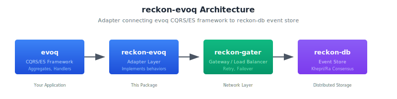

# reckon-evoq

[](https://hex.pm/packages/reckon_evoq)
[](https://hexdocs.pm/reckon_evoq)
[](https://buymeacoffee.com/rlefever)

Adapter for connecting the [evoq](https://codeberg.org/reckon-db-org/evoq) CQRS/ES framework to a [reckon-db](https://codeberg.org/reckon-db-org/reckon-db) event store, reached through the [reckon-gater](https://codeberg.org/reckon-db-org/reckon-gater) gateway API.

reckon-evoq depends on `evoq` and `reckon_gater` only. It does **not** depend on `reckon_db`: it reaches the store through the gater API (see [Reckon stack](#reckon-stack)).

## Overview

reckon-evoq is a thin adapter layer that implements the evoq behavior interfaces:

- `evoq_adapter` - Event store operations (append, read, delete), DCB conditional-append `append_if_no_tag_matches/4` *(2.2.0+, paired with reckon-db 3.1.1)*, and the CCC payload-condition callbacks `ccc_read_by_payload/4`, `ccc_read_by_payload_hash/4`, `payload_indexes/1`, `payload_hash_indexes/1` *(2.7.0+, paired with evoq 1.22 / reckon-gater 3.7)*
- `evoq_snapshot_adapter` - Snapshot operations (save, read, delete)
- `evoq_subscription_adapter` - Subscription operations (subscribe, ack, checkpoint)
- `evoq_checkpoint_store` - Persistent projection checkpoints via ReckonDB snapshots

Every callback is a thin translation: it maps evoq-shaped terms to the gater types, calls `reckon_gater_api`, and maps the result back through `events_to_evoq/1` and friends. The adapter holds no state and runs no logic of its own.

The DCB passthrough is what backs evoq's `evoq_decision` behaviour, see
[evoq's decisions guide](https://codeberg.org/reckon-db-org/evoq/src/branch/main/guides/decisions.md)
for the high-level pattern. The CCC callbacks extend that to payload-conditioned decisions: declared `{payload, Key}` / `{payload_hash, [Keys]}` indexes drive conditional reads, and the introspection callbacks let evoq's decision runtime fail loudly on an undeclared payload index.

All operations are routed through reckon-gater, which provides:

- **Automatic retry** with exponential backoff
- **Load balancing** across gateway workers
- **High availability** with failover support

## Installation

Add to your `rebar.config`:

```erlang
{deps, [
    {reckon_evoq, "~> 2.7"}
]}.
```

### Versions

| Component | Version |
|---|---|
| `reckon_evoq` (this repo) | 2.7.0 |
| `evoq` (dep) | ~> 1.22 |
| `reckon_gater` (dep) | ~> 3.7 |
| `telemetry` (dep) | ~> 1.3 |
| Erlang/OTP | 27+ |

reckon-evoq depends on `evoq` and `reckon_gater` directly. The underlying
`reckon_db` event store must be running and reachable through the gateway, but
is **not** a build dependency of this adapter.

## Dependencies

This adapter requires:

- **evoq** ~> 1.22 - CQRS/ES framework with the behavior definitions (including the CCC payload-condition callbacks added in 1.22)
- **reckon-gater** ~> 3.7 - Gateway API for load balancing, retry, and the `ccc_read_by_payload*` / `get_payload_indexes` surface
- **reckon-db** (runtime) - The underlying event store, reached through the gateway; not a direct build dependency of reckon-evoq

## Quick Start

### 1. Configure evoq to use this adapter

In your `sys.config`:

```erlang
{evoq, [
    {event_store_adapter, reckon_evoq_adapter},
    {snapshot_store_adapter, reckon_evoq_adapter},
    {subscription_adapter, reckon_evoq_adapter}
]}
```

### 2. Ensure reckon-db is running

The adapter requires an reckon-db cluster to be available. Gateway workers automatically discover and connect to reckon-db nodes.

### 3. Use evoq normally

```erlang
%% Create a command
Command = evoq_command:new(deposit, bank_account, <<"acc-123">>, #{amount => 100}),

%% Dispatch through evoq (uses this adapter internally)
ok = evoq_dispatcher:dispatch(Command).
```

## API Reference

### Event Store Operations

```erlang
%% Append events to a stream
reckon_evoq_adapter:append(StoreId, StreamId, ExpectedVersion, Events).
%% Returns: {ok, NewVersion} | {error, Reason}

%% Read events from a stream
reckon_evoq_adapter:read(StoreId, StreamId, StartVersion, Count, Direction).
%% Direction: forward | backward
%% Returns: {ok, [Event]} | {error, Reason}

%% Read all events from a stream (batched internally)
reckon_evoq_adapter:read_all(StoreId, StreamId, Direction).
%% Returns: {ok, [Event]} | {error, Reason}

%% Read events by type (server-side Khepri filtering)
reckon_evoq_adapter:read_by_event_types(StoreId, EventTypes, BatchSize).
%% Returns: {ok, [Event]} | {error, Reason}

%% Get stream version
reckon_evoq_adapter:version(StoreId, StreamId).
%% Returns: Version (integer) | -1 (no stream)

%% Check if stream exists
reckon_evoq_adapter:exists(StoreId, StreamId).
%% Returns: boolean()

%% List all streams
reckon_evoq_adapter:list_streams(StoreId).
%% Returns: {ok, [StreamId]} | {error, Reason}

%% Delete a stream
reckon_evoq_adapter:delete_stream(StoreId, StreamId).
%% Returns: ok | {error, Reason}
```

### Conditional Append, DCB and CCC

```erlang
%% DCB conditional append: append only if no event matches TagFilter past SeqCutoff
reckon_evoq_adapter:append_if_no_tag_matches(StoreId, TagFilter, SeqCutoff, Events).
%% TagFilter: reckon_gater_types:tag_filter()  SeqCutoff: integer() (-1 = saw nothing)
%% Returns: {ok, LastSeq} | {error, {context_changed, MaxSeq}}

%% CCC payload-conditioned reads (2.7.0+, evoq 1.22 / reckon-gater 3.7)
reckon_evoq_adapter:ccc_read_by_payload(StoreId, Key, Value, BatchSize).
reckon_evoq_adapter:ccc_read_by_payload_hash(StoreId, Keys, Values, BatchSize).
%% Keys/Values: equal-length [binary()]  BatchSize: pos_integer()
%% Returns: {ok, [Event]} | {error, Reason}

%% CCC index introspection (used by evoq's decision runtime)
reckon_evoq_adapter:payload_indexes(StoreId).
reckon_evoq_adapter:payload_hash_indexes(StoreId).
%% Returns: the declared payload / payload-hash index key lists
```

### Cross-Cutting Queries

```erlang
%% Read events by tags across all streams
reckon_evoq_adapter:read_by_tags(StoreId, Tags, BatchSize).
reckon_evoq_adapter:read_by_tags(StoreId, Tags, Match, BatchSize).
%% Tags: [binary()]  Match: any | all  BatchSize: pos_integer()
%% Returns: {ok, [Event]} | {error, Reason}

%% Read events whose metadata Key equals Value
reckon_evoq_adapter:read_by_metadata(StoreId, Key, Value).
%% Returns: {ok, [Event]} | {error, Reason}
```

### Snapshot Operations

```erlang
%% Save a snapshot
reckon_evoq_adapter:save(StoreId, StreamId, Version, Data, Metadata).
%% Returns: ok | {error, Reason}

%% Read latest snapshot
reckon_evoq_adapter:read(StoreId, StreamId).
%% Returns: {ok, #snapshot{}} | {error, not_found}

%% Read snapshot at specific version
reckon_evoq_adapter:read_at_version(StoreId, StreamId, Version).
%% Returns: {ok, #snapshot{}} | {error, not_found}

%% Delete all snapshots for stream
reckon_evoq_adapter:delete(StoreId, StreamId).
%% Returns: ok

%% Delete snapshot at specific version
reckon_evoq_adapter:delete_at_version(StoreId, StreamId, Version).
%% Returns: ok | {error, Reason}

%% List snapshot versions
reckon_evoq_adapter:list_versions(StoreId, StreamId).
%% Returns: {ok, [Version]} | {error, Reason}
```

### Subscription Operations

```erlang
%% Subscribe to events
reckon_evoq_adapter:subscribe(StoreId, Type, Selector, Name, Opts).
%% Type: stream | event_type | event_pattern | event_payload
%% Returns: {ok, SubscriptionId} | {error, Reason}

%% Unsubscribe
reckon_evoq_adapter:unsubscribe(StoreId, SubscriptionId).
%% Returns: ok | {error, Reason}

%% Acknowledge event
reckon_evoq_adapter:ack(StoreId, SubscriptionName, StreamId, Position).
%% Returns: ok

%% Get checkpoint (subscription position)
reckon_evoq_adapter:get_checkpoint(StoreId, SubscriptionName).
%% Returns: {ok, Position} | {error, not_found}

%% List all subscriptions
reckon_evoq_adapter:list(StoreId).
%% Returns: {ok, [#subscription{}]} | {error, Reason}

%% Get subscription by name
reckon_evoq_adapter:get_by_name(StoreId, SubscriptionName).
%% Returns: {ok, #subscription{}} | {error, not_found}
```

### Checkpoint Store

```erlang
%% Configure which ReckonDB store holds projection checkpoints
application:set_env(reckon_evoq, checkpoint_store_id, my_store).

%% Use with evoq_projection
evoq_projection:start_link(MyProjection, Config, #{
    checkpoint_store => reckon_evoq_checkpoint_store
}).

%% Checkpoints persist as ReckonDB snapshots.
%% On restart, projections resume from last checkpoint
%% instead of replaying all events.
```

## Architecture



## Local Development

For local development with symlinks:

```bash
mkdir -p _checkouts
ln -s /path/to/evoq _checkouts/evoq
ln -s /path/to/reckon-gater _checkouts/reckon_gater
```

Then compile:

```bash
rebar3 compile
rebar3 eunit
```

## Retry Behavior

The adapter inherits retry behavior from reckon-gater:

- **Base delay**: 100ms
- **Max delay**: 30 seconds
- **Max retries**: 10
- **Backoff**: Exponential with jitter

Failed operations are automatically retried. If all retries fail, the original error is returned.

## Failover Behavior

During leader failover in reckon-db:

1. Gateway detects worker unavailability
2. Requests are routed to healthy workers
3. In-flight writes are retried automatically
4. Reads may return stale data briefly (eventual consistency)

## Version History

See [CHANGELOG.md](CHANGELOG.md) for version history.

## Related Projects

- [evoq](https://codeberg.org/reckon-db-org/evoq) - CQRS/ES framework
- [reckon-db](https://codeberg.org/reckon-db-org/reckon-db) - BEAM-native Event Store
- [reckon-gater](https://codeberg.org/reckon-db-org/reckon-gater) - Gateway API

## Reckon stack

reckon-evoq is one library in the Reckon event-sourcing ecosystem. In dependency order (a library only knows about the ones above it):

- **[reckon-proto](https://codeberg.org/reckon-db-org/reckon-proto)**: the wire-contract protobufs; source of truth for the gateway surface.
- **[reckon-gater](https://codeberg.org/reckon-db-org/reckon-gater)**: shared types and protocols; no Reckon dependencies.
- **[reckon-db](https://codeberg.org/reckon-db-org/reckon-db)**: BEAM-native event store. Depends on reckon_gater, khepri, ra.
- **[reckon-nifs](https://codeberg.org/reckon-db-org/reckon-nifs)**: standalone Rust NIF helpers with pure-Erlang fallbacks.
- **[evoq](https://codeberg.org/reckon-db-org/evoq)**: standalone CQRS/event-sourcing framework; no Reckon dependencies.
- **reckon-evoq (this repo)**: the adapter wiring evoq to a Reckon store. Depends on evoq and reckon_gater; not on reckon_db (reaches the store through the gater API).
- **[reckon-gateway](https://codeberg.org/reckon-db-org/reckon-gateway)**: gRPC + HTTP/JSON ingress. Consumes reckon_gater; can embed reckon_db or federate remote clusters.
- **[reckon-go](https://codeberg.org/reckon-db-org/reckon-go)**: the Go client; talks to reckon-gateway.
- **reckon-portal**: docs and landing site ([reckon-internal/reckon-portal](https://codeberg.org/reckon-internal/reckon-portal)).

## License

Apache-2.0
